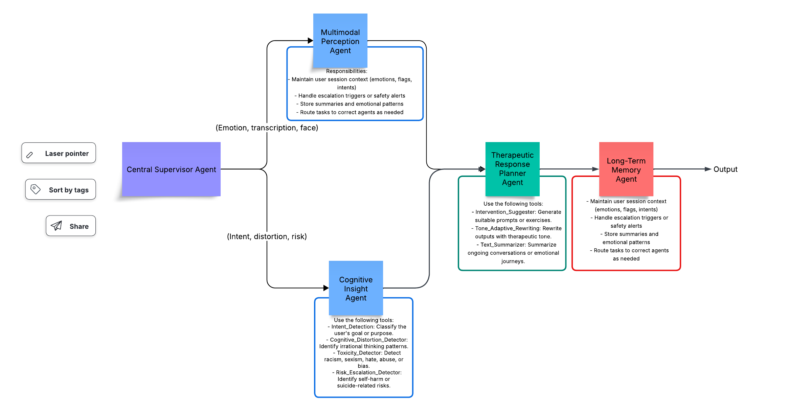

# Multimodal Therapy Assistant

Welcome to the Multimodal Therapy Assistant, a scalable, intelligent multi-agent system designed to support emotional wellness and therapeutic interaction using multimodal inputs (text, voice, face).  
This architecture combines perception, cognitive understanding, therapeutic generation, and memory tracking — all orchestrated through a central supervisor for safety, adaptability, and extensibility.

---

## System Overview

The system operates through a **Central Supervisor Agent**, which routes user inputs to specialized agents depending on the modality and context.

---

## Agents and Their Roles

### Central Supervisor Agent

- **Core orchestrator** of the system
- Routes messages based on input modality and user state
- Coordinates between Perception, Cognitive, Therapy, and Memory agents
- Ensures safety policies, risk protocols, and adaptive flow control

---

### Multimodal Perception Agent

**Purpose:** Understands the user’s emotional state through various channels (text, audio, face)

**Responsibilities:**
- Convert audio to text
- Detect voice tone & face emotion
- Tag user input with emotion, energy, and expression
- Pass metadata to Cognitive & Therapy agents

**Tools Used:**
- MP3_to_WAV
- Audio_Transcription
- Voice_Emotion_Detection
- Text_Emotion_Analysis
- Face_Attributes_Detection

---

### Cognitive Insight Agent

**Purpose:** Analyzes intent, cognitive patterns, and safety risks from user input

**Responsibilities:**
- Determine user’s goal or emotional intent
- Identify irrational thoughts or cognitive distortions
- Detect toxicity, abuse, or social bias
- Trigger escalation for suicide or self-harm

**Tools Used:**
- Intent_Detection
- Cognitive_Distortion_Detector
- Toxicity_Detector
- Risk_Escalation_Detector

---

### Therapeutic Response Planner Agent

**Purpose:** Generates a supportive, therapeutic response based on the user’s needs

**Responsibilities:**
- Choose appropriate CBT, DBT, or supportive intervention
- Rephrase output with a compassionate and empathetic tone
- Summarize emotional journey or patterns as needed

**Tools Used:**
- Intervention_Suggester
- Tone_Adaptive_Rewriting
- Text_Summarizer

---

### Long-Term Memory Agent

**Purpose:** Tracks the user’s emotional evolution and stores therapeutic context

**Responsibilities:**
- Maintain session history (emotions, intents, interventions)
- Store cognitive patterns and behavioral trends
- Assist in personalization and continuity
- Handle re-routing based on previous state

---

## Output Pipeline

Final responses are composed by the Therapeutic Response Planner, enriched with metadata from memory/context, and passed to the user.

---