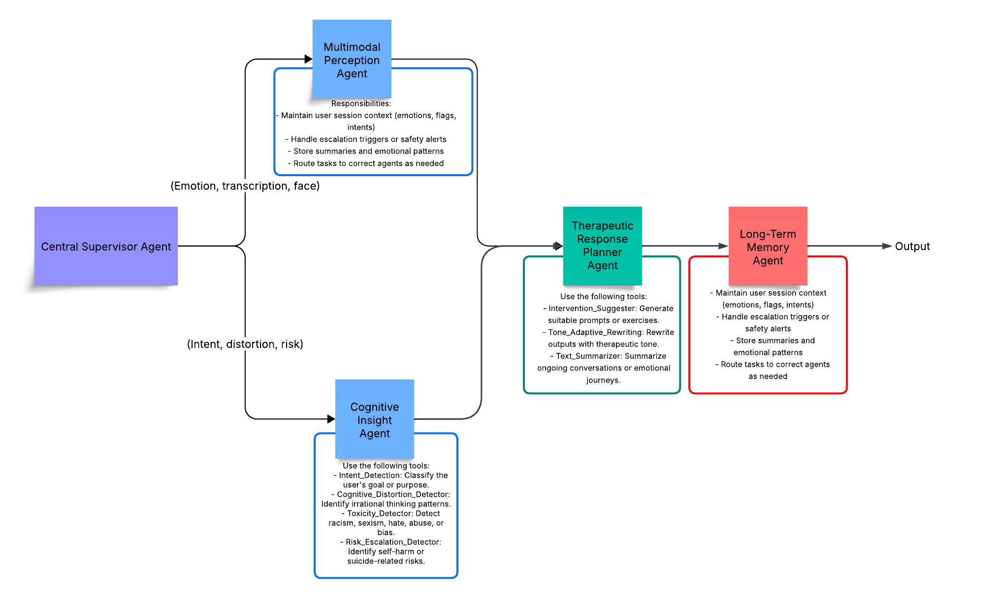

# Multimodal-Therapy-Assistant

An intelligent, privacy-aware assistant that combines text, voice, and facial cues to support users in journaling, emotional expression, and therapeutic conversation. Built using LangGraph, LLMs, and multimodal emotion recognition, this project explores the next frontier in human-AI emotional interaction.
